# Amazon OpenSearch Service on AWS

## Table of contents

- [What's included](#whats-included)
- [Main Tutorial](#main-tutorial)
- [Useful Links](#useful-link)
- [Creators](#creators)

## What's included

The repo is to supplement the [youtube video](https://youtu.be/grfSNj2EMwo) on Opensearch Service in AWS.


## Main Tutorial

1. Create Domain

    Select Create Domain 
    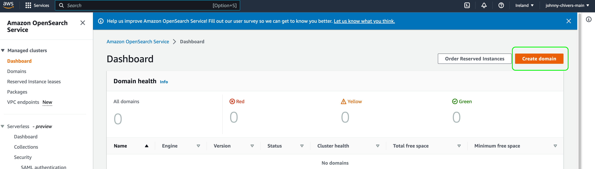


    Enter a Domain Name. Select Development and Testing for Deployment Type
    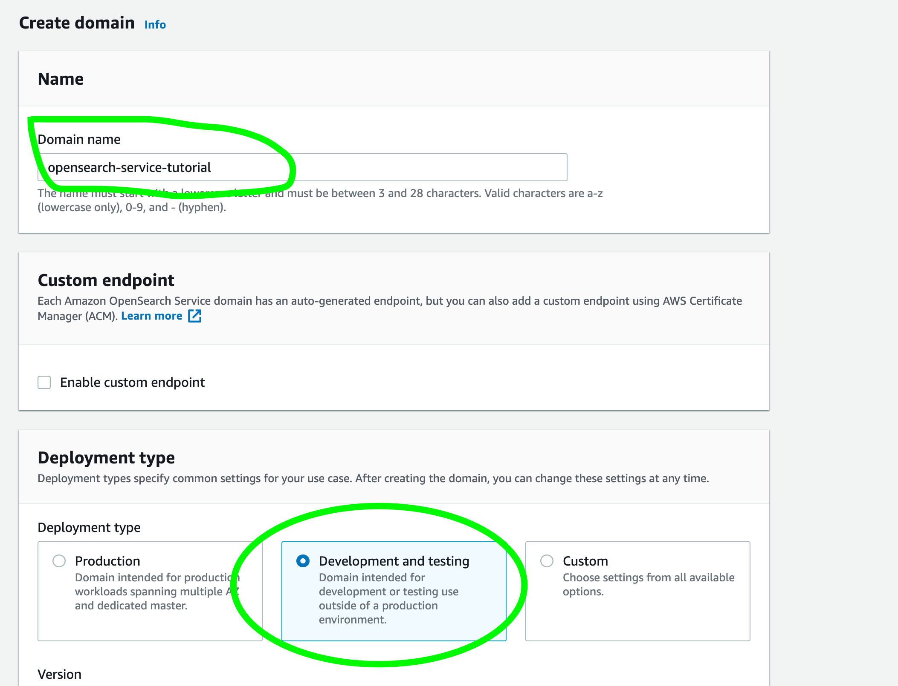


    Select `t3.small.search` Node Type
    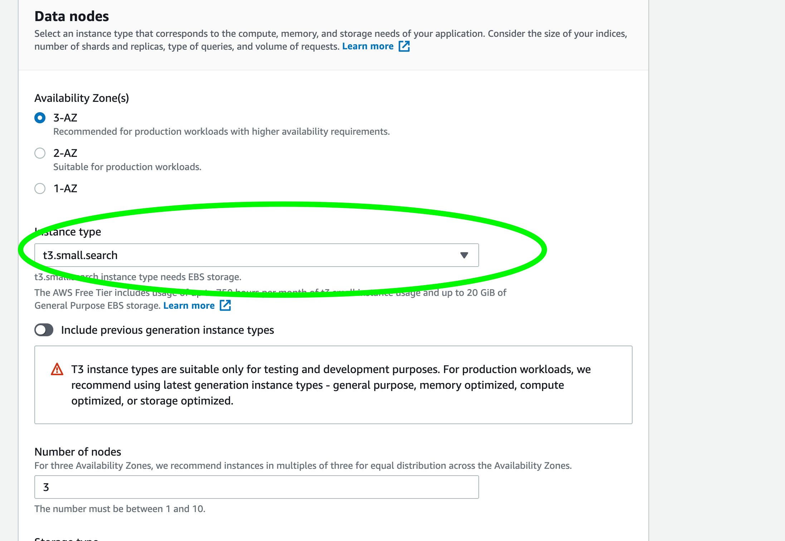


    Select `Public access`
    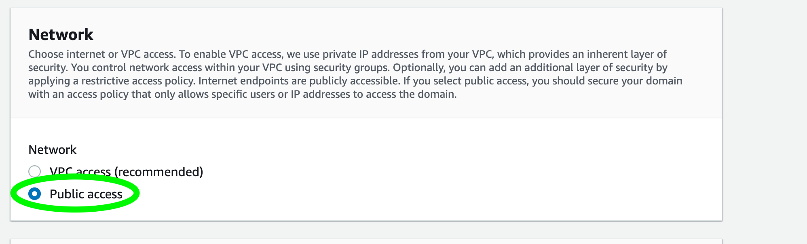


    Select `create master user` and Enter Username/Password 
    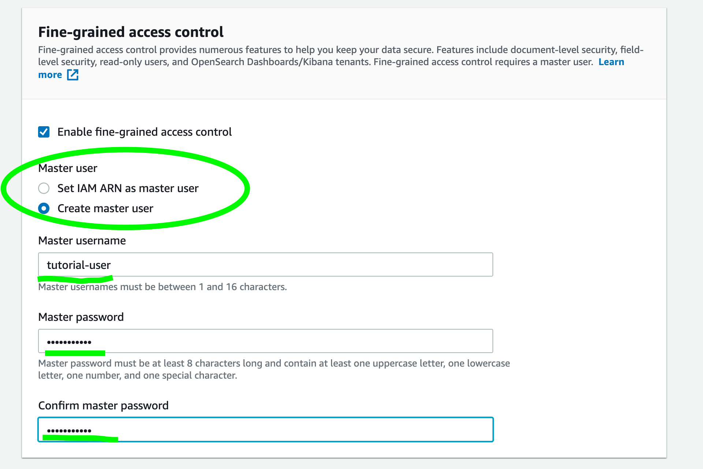


    Select `only use fine-grain control`
    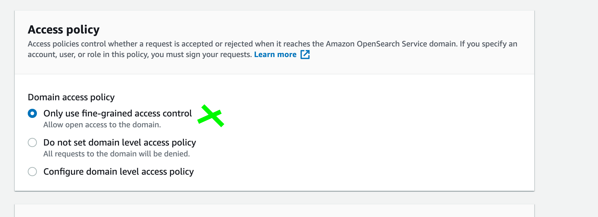


    Select `create`
    


    After 10-15mins Your Domain Will Be Ready
    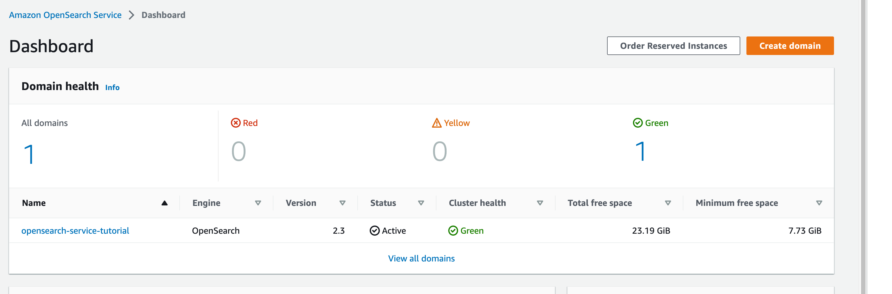

2. Upload Documents 

    Upload a signle document using the api 
    ```
    curl -XPUT -u 'master-user:master-user-password' 'domain-endpoint/movies/_doc/1' -d '{"director": "Burton, Tim", "genre": ["Comedy","Sci-Fi"], "year": 1996, "actor": ["Jack Nicholson","Pierce Brosnan","Sarah Jessica Parker"], "title": "Mars Attacks!"}' -H 'Content-Type: application/json'
    ```

    Upload multiple documents 
    create a json file and upload 
    ```
    curl -XPOST -u 'master-user:master-user-password' 'domain-endpoint/_bulk' --data-binary @bulk_movies.json -H 'Content-Type: application/json'
    ```

3. Search for Document using API 

    search for a document via API 
    ```
    curl -XGET -u 'master-user:master-user-password' 'domain-endpoint/movies/_search?q=mars&pretty=true'
    ```

4. Search for document via UI
    Search Via UI
    ```
    domain-endpoint/_dashboards/
    ```

    Once on the dashboard click `Discover` on the left handside
    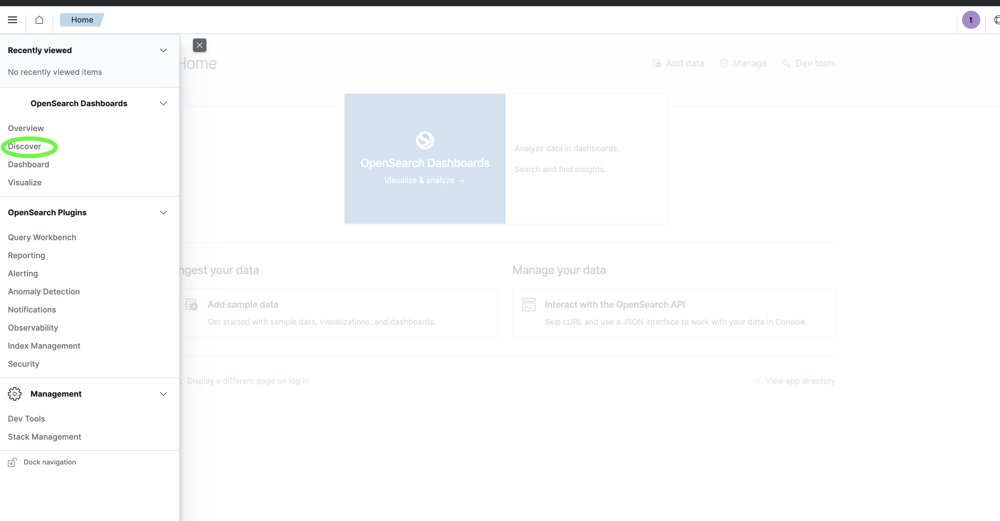

    Click `Create index pattern`
    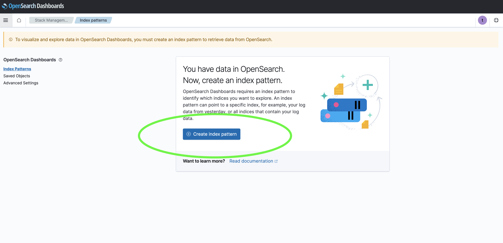

    Type `movies` into the text input box and click `Next Step`
    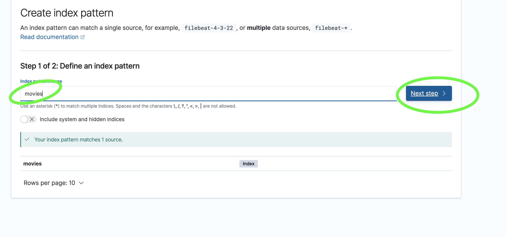

    Click `Create Index`
    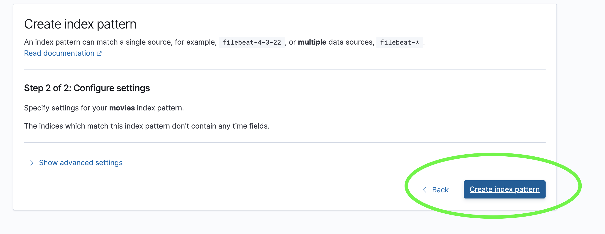

    The searchable index pattern will be created and the fields listed
    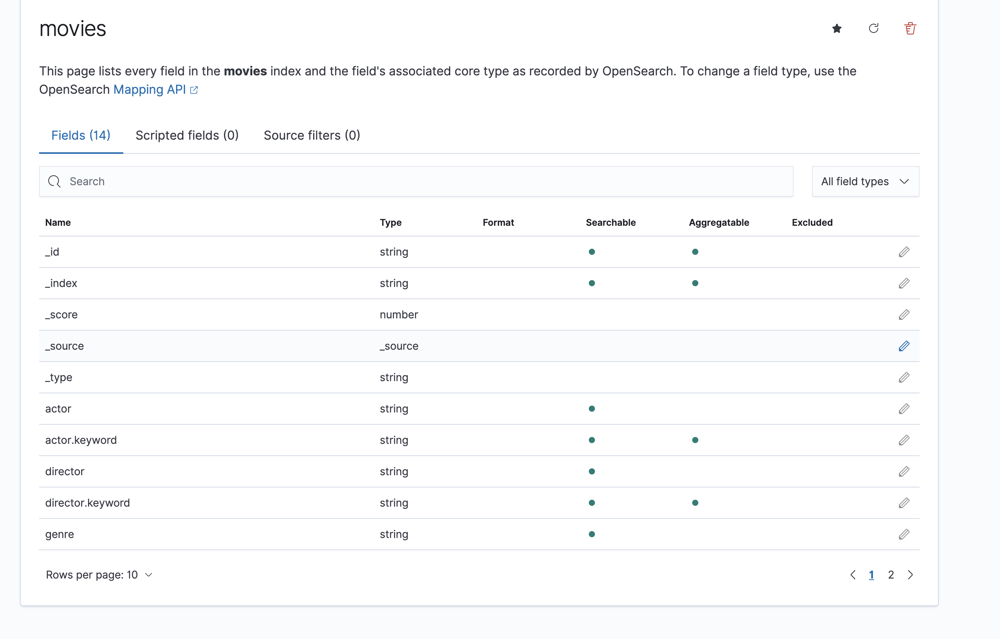

    Click the hamburger menu on the left hand side and click `Discovery` again. 
    The searchable index will now appear. 
    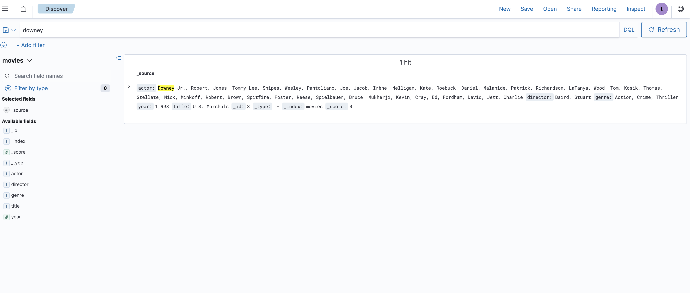

5. Delete a domain 

    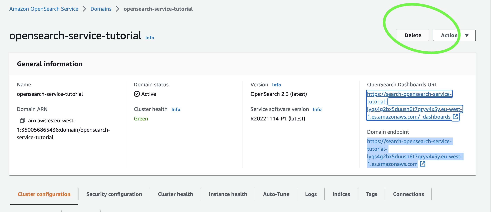


## Creators

**Johnny Chivers**

- <https://github.com/johnny-chivers/>

## Useful Links

- [youtube video](https://youtu.be/grfSNj2EMwo) 
- [website](https://www.johnnychivers.co.uk)
- [buy me a coffee](https://www.buymeacoffee.com/johnnychivers)


Enjoy :metal:
